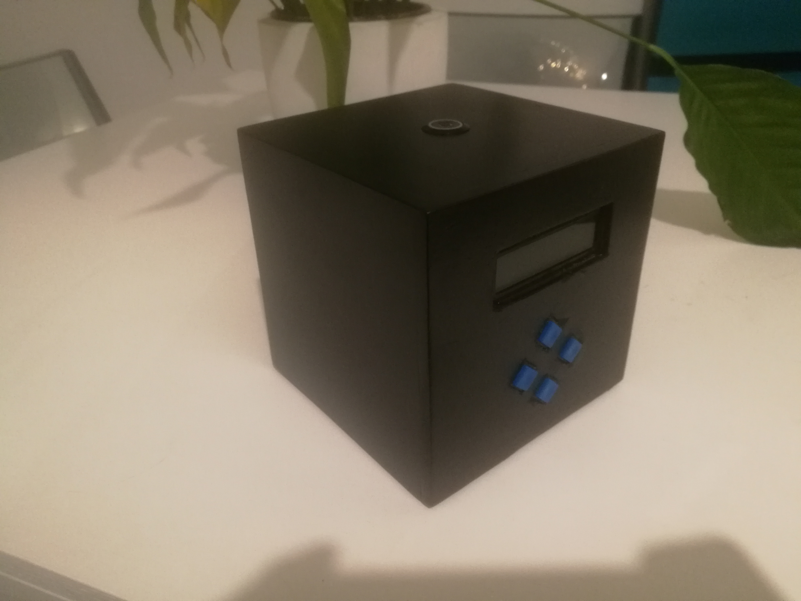
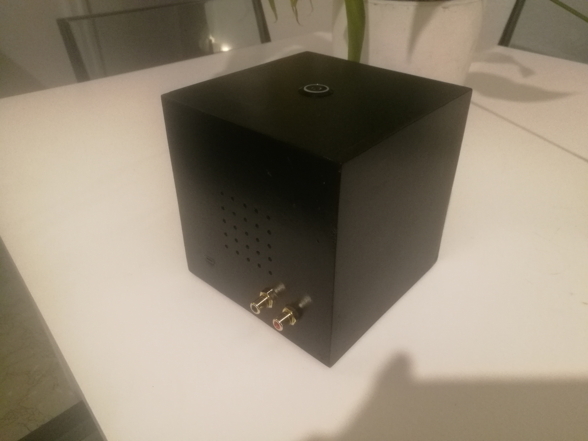

# Radiobot

Radiobot is a flexible web radio player written in python, made for a raspberry pi project with DAC output.

 

## Prerequisites

Hardware (not exhaustive) :

* 1x Raspberry Pi 3 B+
* 1x Hifiberry DAC
* 1x Power button
* 4x Control buttons 
* LED screen
* ATtiny85 microcontroller
* Wires and connectors

Software :

* Python development environment
* A Raspberry Pi 3 B+ running an healthy version of Raspbian and connected to Wifi network (OS configuration not covered here)

## Todo list

* Improve readme file 
* 

## Authors

* **Sylvain Benech** - *Initial work* - [Chuck182](https://github.com/Chuck182)

## License

This project is licensed under the GPL v3 License - see the [LICENSE.md](LICENSE.md) file for details
